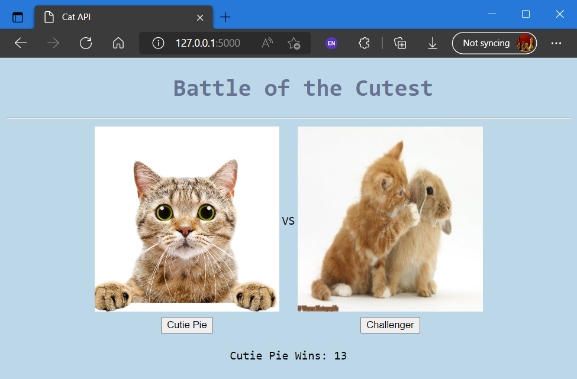

# Battle of the Cutest Game

As per the assignment, data (in the form of images) was retrieved from the API endpoint at thecatapi.com.

The user is then displayed 2 images and must decide which image is cuter.

The "Cutie Pie" is the image displayed on the left, which is the reigning cutest.

The "Challenger" image is displayed on the right and if it is deemed cutest, then moves to the "Cutie Pie" spot on the left with a new "Challenger" image retrieved.

The Cutie Pie win counter starts at 0 for a new game and increases by 1 for each "Cutie Pie" button click by the user.

The counter is set to 1 when the "Challenger" button is clicked.

## File Organisation

All code can be found in the 'src' directory, while the csv files used for storage of images and win counter are located in the 'data storage' directory.
